# toy_datasets

Python package providing a unified interface for loading synthetic and real-world toy datasets for ML experimentation.

## Features

- Unified API for 20+ datasets via `get_dataset(name)`
- Consistent dict format: `{'X': features, 'y': labels}`
- Built-in train/test splitting with class balance preservation
- MinMax normalization to [-1, 1] range
- Dimensionality reduction (PCA, UMAP, t-SNE)
- Terminal-based plotting (sixel/kitty protocols)


## Available Datasets

**Synthetic:**
- `XOR`, `Moons`, `Blobs`, `Circles`, `Gaussian`, `Sklearn Normal`

**Classic (sklearn):**
- `Iris`, `Wine`, `Breast Cancer`

**Medical:**
- `Diabetes Pima Indian`, `Heart Disease`, `Breast Cancer Wisconsin`
- `Habermans Breast Cancer`, `Chronic Kidney Disease`, `Hepatitis`

**Image:**
- `MNIST`, `CIFAR-10`, `CIFAR-100`, `CIFAR-10N`

**Other:**
- `Banknote Authentication`, `Wheat Seeds`, `Ionosphere`
- `Sonar Rocks vs Mines`, `Abalone Gender`
- `Costcla Credit Scoring Kaggle 2011`, `Costcla Credit Scoring PAKDD 2009`
- `Costcla Direct Marketing`

List all available datasets:
```python
from data_loaders.main import AVAILABLE_DATASETS
print(list(AVAILABLE_DATASETS.keys()))
```

### Dataset Preview

The **Moons** dataset — two interleaved half-circles, a classic benchmark for non-linear classifiers:

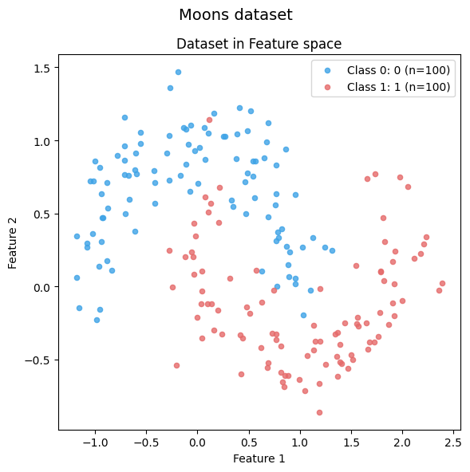

#### All Datasets (click to expand)
<details>
<summary><strong>Synthetic</strong></summary>

#### XOR

```
Data Loader for XOR Synthetic

 Label Names:
    - Label 0: 0
    - Label 1: 1
    - Label 2: 2
    - Label 3: 3

 Dataset Info:
    - Number of features: 2
    - Total instances: 200
      - Class 0: 100 instances (0)
      - Class 1: 100 instances (1)
```

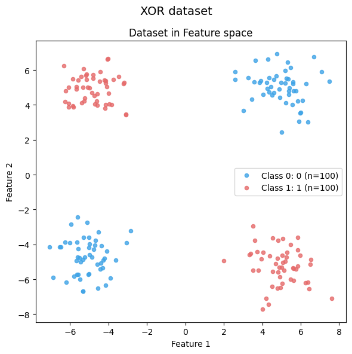

#### Moons

```
Data Loader for Moons Synthetic

 Label Names:
    - Label 0: 0
    - Label 1: 1
    - Label 2: 2
    - Label 3: 3

 Dataset Info:
    - Number of features: 2
    - Total instances: 200
      - Class 0: 100 instances (0)
      - Class 1: 100 instances (1)
```


#### Blobs

```
Data Loader for Blobs Synthetic

 Label Names:
    - Label 0: 0
    - Label 1: 1
    - Label 2: 2
    - Label 3: 3

 Dataset Info:
    - Number of features: 2
    - Total instances: 200
      - Class 0: 100 instances (0)
      - Class 1: 100 instances (1)
```

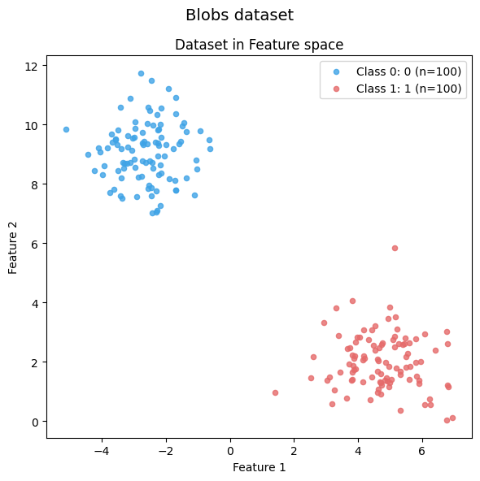

#### Circles

```
Data Loader for Circles Synthetic

 Label Names:
    - Label 0: 0
    - Label 1: 1
    - Label 2: 2
    - Label 3: 3

 Dataset Info:
    - Number of features: 2
    - Total instances: 200
      - Class 0: 100 instances (0)
      - Class 1: 100 instances (1)
```

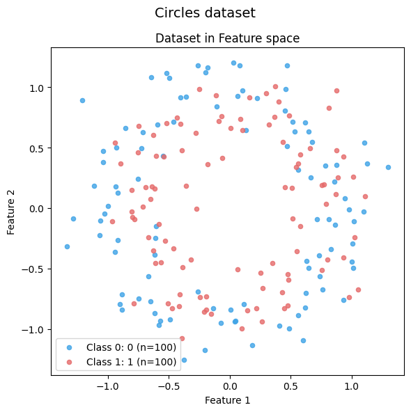

#### Sklearn Normal

```
Data Loader for Sklearn Synthetic Classification (Normal)

 Label Names:
    - Label 0: 0
    - Label 1: 1
    - Label 2: 2
    - Label 3: 3

 Dataset Info:
    - Number of features: 20
    - Total instances: 200
      - Class 0: 102 instances (0)
      - Class 1: 98 instances (1)
```

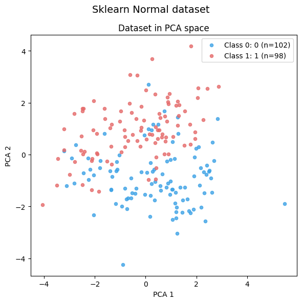

#### Gaussian

```
Data Loader for Gaussian Synthetic

 Feature Names:
    - Feature 0: Feature 1
    - Feature 1: Feature 2

 Label Names:
    - Label 0: Class 0
    - Label 1: Class 1

 Dataset Info:
    - Number of features: 2
    - Total instances: 200
      - Class 0: 100 instances (Class 0)
      - Class 1: 100 instances (Class 1)
```

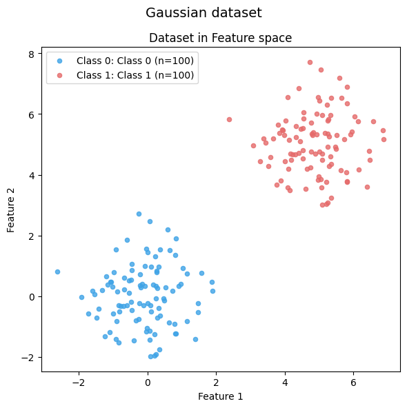

</details>

<details>
<summary><strong>Classic (sklearn)</strong></summary>

#### Iris

```
Data Loader for Iris

 Feature Names:
    - Feature 0: sepal length (cm)
    - Feature 1: sepal width (cm)
    - Feature 2: petal length (cm)
    - Feature 3: petal width (cm)

 Label Names:
    - Label 0: setosa and virginica
    - Label 1: versicolor

 Dataset Info:
    - Number of features: 4
    - Total instances: 150
      - Class 0: 100 instances (setosa and virginica)
      - Class 1: 50 instances (versicolor)
```

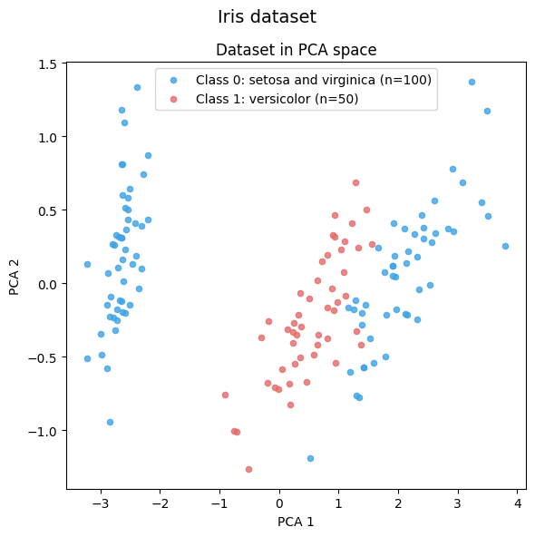

#### Wine

```
Data Loader for Wine

 Feature Names:
    - Feature 0: alcohol
    - Feature 1: malic_acid
    - Feature 2: ash
    - Feature 3: alcalinity_of_ash
    - Feature 4: magnesium
    - Feature 5: total_phenols
    - Feature 6: flavanoids
    - Feature 7: nonflavanoid_phenols
    - Feature 8: proanthocyanins
    - Feature 9: color_intensity
    - Feature 10: hue
    - Feature 11: od280/od315_of_diluted_wines
    - Feature 12: proline

 Label Names:
    - Label 0: class_0
    - Label 1: class_1 and class_2

 Dataset Info:
    - Number of features: 13
    - Total instances: 178
      - Class 0: 59 instances (class_0)
      - Class 1: 119 instances (class_1 and class_2)
```

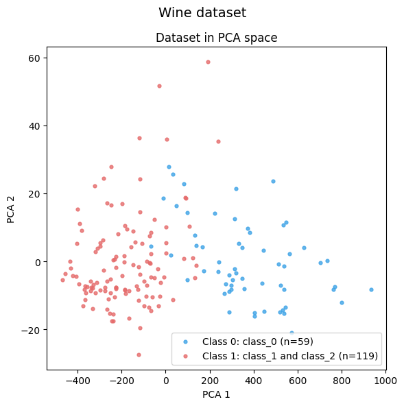

#### Breast Cancer

```
Data Loader for Breast Cancer

 Feature Names:
    - Feature 0: mean radius
    - Feature 1: mean texture
    - Feature 2: mean perimeter
    - Feature 3: mean area
    - Feature 4: mean smoothness
    - Feature 5: mean compactness
    - Feature 6: mean concavity
    - Feature 7: mean concave points
    - Feature 8: mean symmetry
    - Feature 9: mean fractal dimension
    - Feature 10: radius error
    - Feature 11: texture error
    - Feature 12: perimeter error
    - Feature 13: area error
    - Feature 14: smoothness error
    - Feature 15: compactness error
    - Feature 16: concavity error
    - Feature 17: concave points error
    - Feature 18: symmetry error
    - Feature 19: fractal dimension error
    - Feature 20: worst radius
    - Feature 21: worst texture
    - Feature 22: worst perimeter
    - Feature 23: worst area
    - Feature 24: worst smoothness
    - Feature 25: worst compactness
    - Feature 26: worst concavity
    - Feature 27: worst concave points
    - Feature 28: worst symmetry
    - Feature 29: worst fractal dimension

 Label Names:
    - Label 0: benign
    - Label 1: malignant

 Dataset Info:
    - Number of features: 30
    - Total instances: 569
      - Class 0: 357 instances (benign)
      - Class 1: 212 instances (malignant)
```

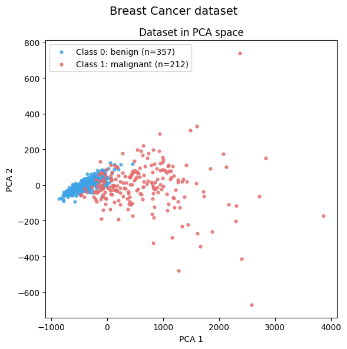

</details>

<details>
<summary><strong>Medical</strong></summary>

#### Diabetes Pima Indian

```
Data Loader for Diabetes Pima Indians

 Feature Names:
    - Feature 0: Pregnancies
    - Feature 1: Glucose
    - Feature 2: BloodPressure
    - Feature 3: SkinThickness
    - Feature 4: Insulin
    - Feature 5: BMI
    - Feature 6: DiabetesPedigreeFunction
    - Feature 7: Age

 Label Names:
    - Label 0: No Diabetes
    - Label 1: Diabetes

 Dataset Info:
    - Number of features: 8
    - Total instances: 768
      - Class 0: 500 instances (No Diabetes)
      - Class 1: 268 instances (Diabetes)
```

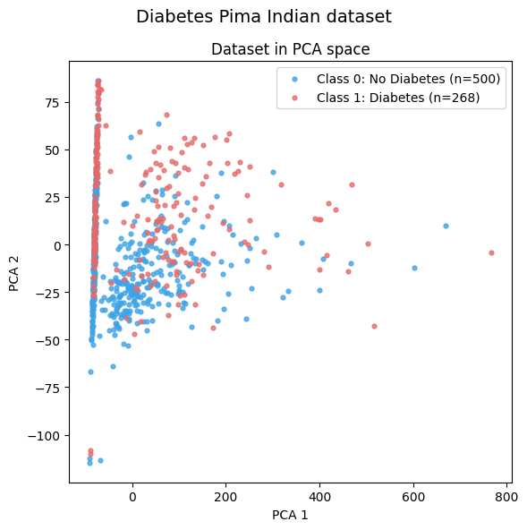

#### Heart Disease

```
Data Loader for Heart Disease

 Label Names:
    - Label 0: no heart disease
    - Label 1: heart disease

 Dataset Info:
    - Number of features: 11
    - Total instances: 212
      - Class 0: 164 instances (no heart disease)
      - Class 1: 48 instances (heart disease)
```

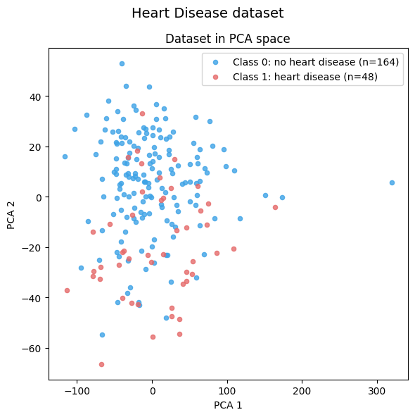

#### Breast Cancer Wisconsin

```
Data Loader for Wisconsin Breast Cancer

 Feature Names:
    - Feature 0: radius1
    - Feature 1: texture1
    - Feature 2: perimeter1
    - Feature 3: area1
    - Feature 4: smoothness1
    - Feature 5: compactness1
    - Feature 6: concavity1
    - Feature 7: concave_points1
    - Feature 8: symmetry1
    - Feature 9: fractal_dimension1
    - Feature 10: radius2
    - Feature 11: texture2
    - Feature 12: perimeter2
    - Feature 13: area2
    - Feature 14: smoothness2
    - Feature 15: compactnes2
    - Feature 16: concavity2
    - Feature 17: concave_points2
    - Feature 18: symmetry2
    - Feature 19: fractal_dimension2
    - Feature 20: radius3
    - Feature 21: texture3
    - Feature 22: perimeter3
    - Feature 23: area3
    - Feature 24: smoothness3
    - Feature 25: compactness3
    - Feature 26: concavity3
    - Feature 27: concave_points3
    - Feature 28: symmetry3
    - Feature 29: fractal_dimension3

 Label Names:
    - Label 0: Benign
    - Label 1: Malignant

 Dataset Info:
    - Number of features: 30
    - Total instances: 569
      - Class 0: 357 instances (Benign)
      - Class 1: 212 instances (Malignant)
```

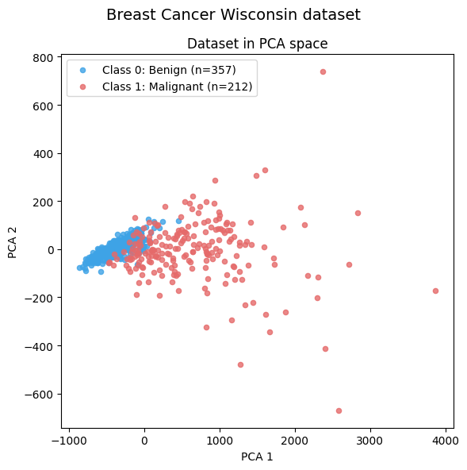

#### Habermans Breast Cancer

```
Data Loader for Habermans Breast Cancer

 Feature Names:
    - Feature 0: Age
    - Feature 1: Operation_Year
    - Feature 2: Positive_Aux_Nodes

 Label Names:
    - Label 0: survived 5 years or longer
    - Label 1: died within 5 year

 Dataset Info:
    - Number of features: 3
    - Total instances: 306
      - Class 0: 225 instances (survived 5 years or longer)
      - Class 1: 81 instances (died within 5 year)
```

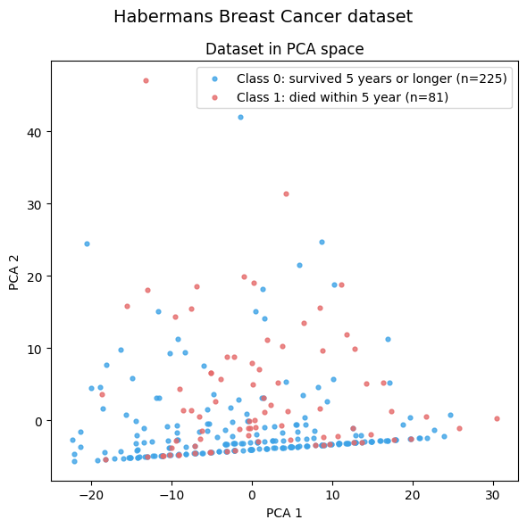

#### Chronic Kidney Disease

```
Data Loader for Chronic Kidney Disease

 Feature Names:
    - Feature 0: age
    - Feature 1: blood pressure
    - Feature 2: specific gravity
    - Feature 3: pus cell
    - Feature 4: pus cell clumps
    - Feature 5: bacteria
    - Feature 6: blood urea
    - Feature 7: serum creatinine
    - Feature 8: hemoglobin
    - Feature 9: hypertension
    - Feature 10: diabetes mellitus
    - Feature 11: coronary artery disease
    - Feature 12: appetite
    - Feature 13: pedal edema
    - Feature 14: anemia

 Label Names:
    - Label 0: Chronic Kidney Disease
    - Label 1: Not Chronic Kidney Disease

 Dataset Info:
    - Number of features: 15
    - Total instances: 268
      - Class 0: 121 instances (Chronic Kidney Disease)
      - Class 1: 147 instances (Not Chronic Kidney Disease)
```

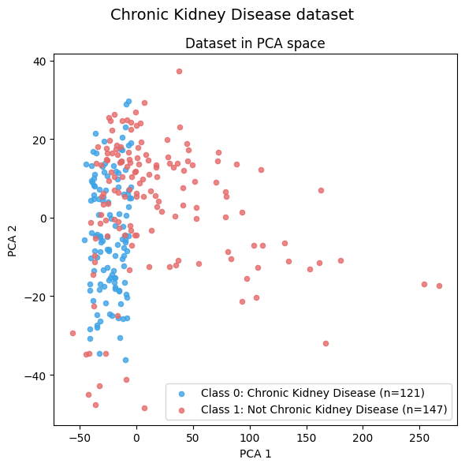

#### Hepatitis

```
Data Loader for Hepatitis

 Feature Names:
    - Feature 0: AGE
    - Feature 1: SEX
    - Feature 2: STEROID
    - Feature 3: ANTIVIRALS
    - Feature 4: FATIGUE
    - Feature 5: MALAISE
    - Feature 6: ANOREXIA
    - Feature 7: LIVERBIG
    - Feature 8: LIVERFIRM
    - Feature 9: SPLEENPALPABLE
    - Feature 10: SPIDERS
    - Feature 11: ASCITES
    - Feature 12: VARICES
    - Feature 13: BILIRUBIN
    - Feature 14: SGOT
    - Feature 15: HISTOLOGY

 Label Names:
    - Label 0: Survived
    - Label 1: Died

 Dataset Info:
    - Number of features: 16
    - Total instances: 137
      - Class 0: 111 instances (Survived)
      - Class 1: 26 instances (Died)
```

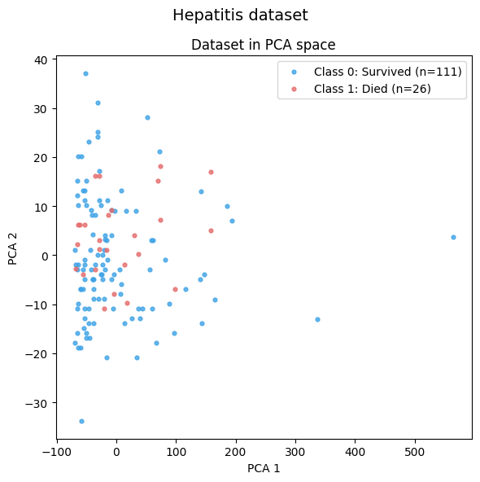

</details>

<details>
<summary><strong>Other</strong></summary>

#### Banknote Authentication

```
Data Loader for Banknote Authentication

 Feature Names:
    - Feature 0: variance of Wavelet Transformed image
    - Feature 1: skewness of Wavelet Transformed image
    - Feature 2: curtosis of Wavelet Transformed image
    - Feature 3: entropy of image

 Label Names:
    - Label 0: Authentic
    - Label 1: Counterfeit

 Dataset Info:
    - Number of features: 4
    - Total instances: 1372
      - Class 0: 762 instances (Authentic)
      - Class 1: 610 instances (Counterfeit)
```

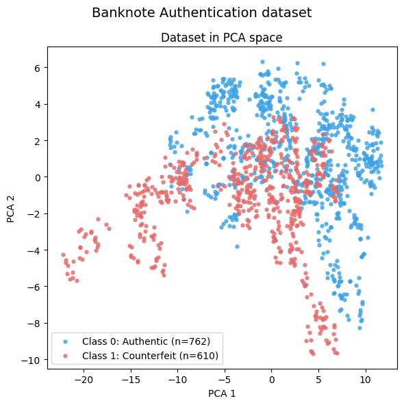

#### Wheat Seeds

```
Data Loader for Wheat Seeds

 Feature Names:
    - Feature 0: area
    - Feature 1: perimeter
    - Feature 2: compactness
    - Feature 3: length of kernel
    - Feature 4: width of kernel
    - Feature 5: asymmetry coefficient
    - Feature 6: length of kernel groove

 Label Names:
    - Label 0: Rosa or Canadian
    - Label 1: Kama

 Dataset Info:
    - Number of features: 7
    - Total instances: 210
      - Class 0: 140 instances (Rosa or Canadian)
      - Class 1: 70 instances (Kama)
```

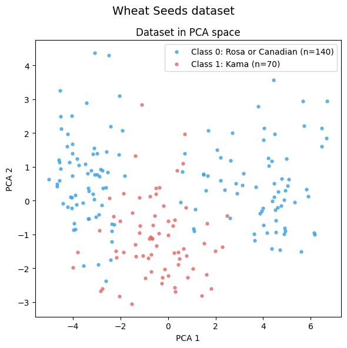

#### Ionosphere

```
Data Loader for Ionosphere

 Feature Names:
    - Feature 0: Pulse 1 real
    - Feature 1: Pulse 1 imaginary
    - Feature 2: Pulse 2 real
    - Feature 3: Pulse 2 imaginary
    - Feature 4: Pulse 3 real
    - Feature 5: Pulse 3 imaginary
    - Feature 6: Pulse 4 real
    - Feature 7: Pulse 4 imaginary
    - Feature 8: Pulse 5 real
    - Feature 9: Pulse 5 imaginary
    - Feature 10: Pulse 6 real
    - Feature 11: Pulse 6 imaginary
    - Feature 12: Pulse 7 real
    - Feature 13: Pulse 7 imaginary
    - Feature 14: Pulse 8 real
    - Feature 15: Pulse 8 imaginary
    - Feature 16: Pulse 9 real
    - Feature 17: Pulse 9 imaginary
    - Feature 18: Pulse 10 real
    - Feature 19: Pulse 10 imaginary
    - Feature 20: Pulse 11 real
    - Feature 21: Pulse 11 imaginary
    - Feature 22: Pulse 12 real
    - Feature 23: Pulse 12 imaginary
    - Feature 24: Pulse 13 real
    - Feature 25: Pulse 13 imaginary
    - Feature 26: Pulse 14 real
    - Feature 27: Pulse 14 imaginary
    - Feature 28: Pulse 15 real
    - Feature 29: Pulse 15 imaginary
    - Feature 30: Pulse 16 real
    - Feature 31: Pulse 16 imaginary
    - Feature 32: Pulse 17 real
    - Feature 33: Pulse 17 imaginary

 Label Names:
    - Label 0: bad
    - Label 1: good

 Dataset Info:
    - Number of features: 34
    - Total instances: 351
      - Class 0: 126 instances (bad)
      - Class 1: 225 instances (good)
```

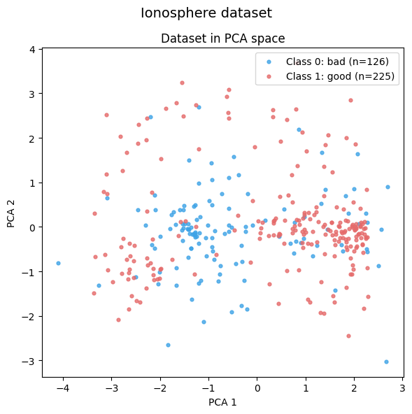

#### Sonar Rocks vs Mines

```
Data Loader for Sonar Rocks vs Mines

 Label Names:
    - Label 0: Rock
    - Label 1: Mine

 Dataset Info:
    - Number of features: 60
    - Total instances: 208
      - Class 0: 97 instances (Rock)
      - Class 1: 111 instances (Mine)
```

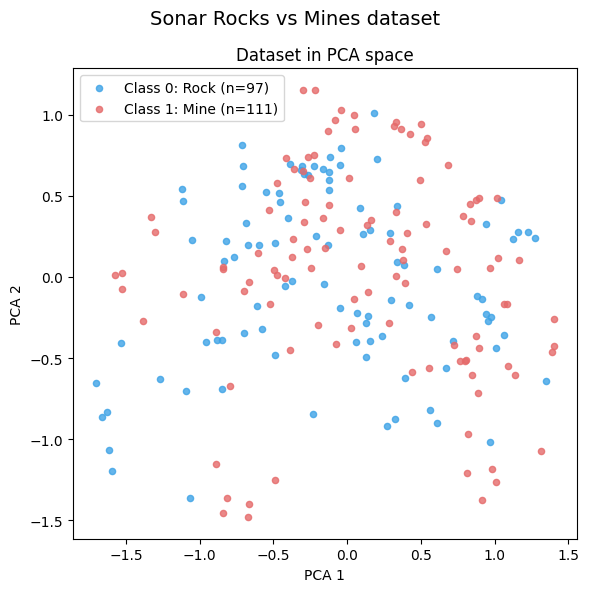

#### Abalone Gender

```
Data Loader for Abalone Gender

 Feature Names:
    - Feature 0: Length
    - Feature 1: Diameter
    - Feature 2: Height
    - Feature 3: Whole weight
    - Feature 4: Shucked weight
    - Feature 5: Viscera weight
    - Feature 6: Shell weight
    - Feature 7: Rings

 Label Names:
    - Label 0: Male
    - Label 1: Female

 Dataset Info:
    - Number of features: 8
    - Total instances: 2835
      - Class 0: 1528 instances (Male)
      - Class 1: 1307 instances (Female)
```

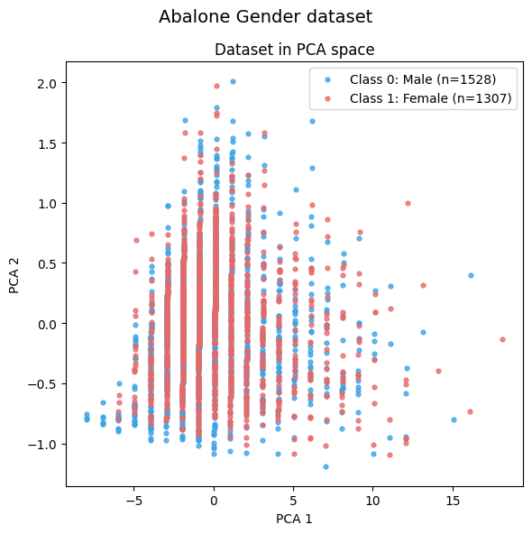

</details>

<details>
<summary><strong>Image</strong></summary>

#### MNIST

```
Data Loader for MNIST

 Label Names:
    - Label 0: Digits 0-8
    - Label 1: Digit 9

 Dataset Info:
    - Number of features: 784
    - Total instances: 60000
      - Class 0: 54077 instances (Digits 0-8)
      - Class 1: 5923 instances (Digit 9)
```

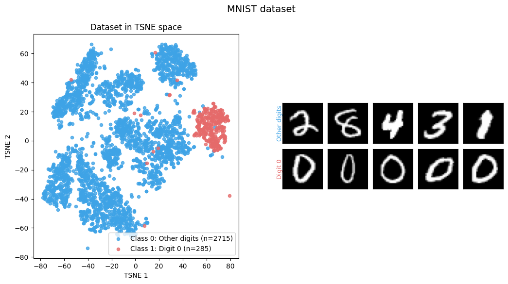

#### CIFAR-10

```
Data Loader for CIFAR-10

 Label Names:
    - Label 0: Other classes
    - Label 1: airplane

 Dataset Info:
    - Number of features: 3072
    - Total instances: 50000
      - Class 0: 45000 instances (Other classes)
      - Class 1: 5000 instances (airplane)
```

32×32 RGB images flattened to 3072-dimensional vectors. Binary mode pits one class against all others.

```python
loader = get_dataset('CIFAR-10', binary=False)  # all 10 classes
loader = get_dataset('CIFAR-10', minority_id=[3, 5])  # cat + dog vs rest
```

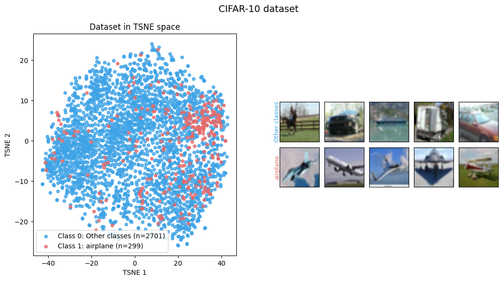

#### CIFAR-100

```
Data Loader for CIFAR-100

 Label Names:
    - Label 0: Other classes
    - Label 1: apple

 Dataset Info:
    - Number of features: 3072
    - Total instances: 50000
      - Class 0: 49500 instances (Other classes)
      - Class 1: 500 instances (apple)
```

Same 32×32 RGB format as CIFAR-10 but with 100 fine-grained classes (e.g. apple, bicycle, dolphin).

```python
loader = get_dataset('CIFAR-100', binary=False)  # all 100 classes
loader = get_dataset('CIFAR-100', minority_id=[0, 8])  # apple + bicycle vs rest
```

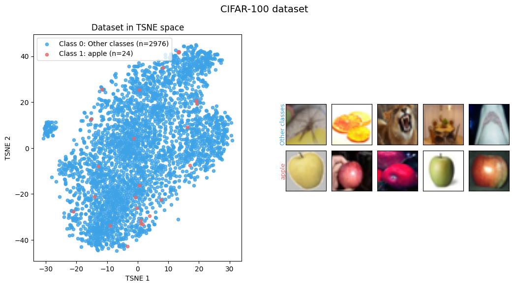

#### CIFAR-10N

CIFAR-10N uses the same images as CIFAR-10 but replaces clean labels with real human annotation
noise from the CIFAR-10N paper (Wei et al., 2022). Useful for benchmarking label-noise-robust methods.

The noisy label file (`CIFAR-10_human.pt`) must be placed manually at
`data_loaders/loaders/datasets/CIFAR-10N/CIFAR-10_human.pt` (see the loader docstring for instructions).

```python
# Choose a label noise type: 'aggre_label' (default), 'random_label1/2/3', 'worst_label'
loader = get_dataset('CIFAR-10N', label_noise_type='worst_label')
```

</details>

<details>
<summary><strong>Loader options — visual demos</strong></summary>

### `get_train_test_split(train_size=...)`

Splits data into train and test sets while preserving class proportions.
`train_size` controls the fraction used for training (default `0.5`).

```python
train, test = get_dataset('Moons', train_size=0.7).get_train_test_split()
```

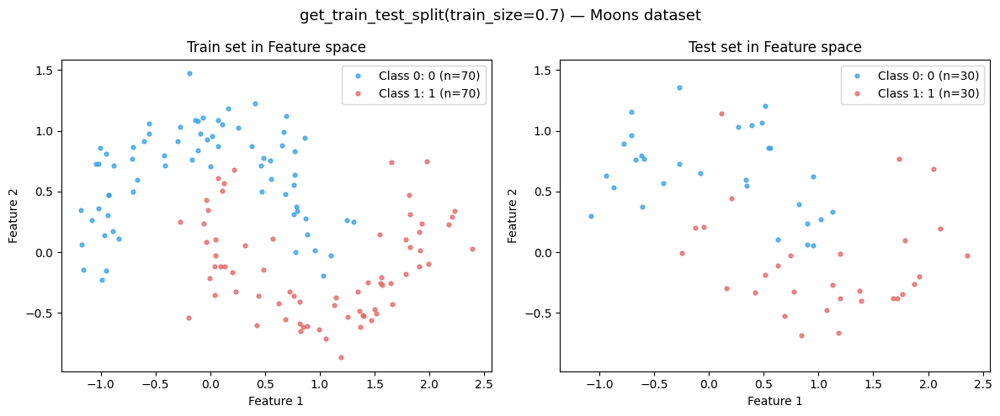

---

### `scale=True`

Applies MinMax normalisation fitted on the train set, scaling all features to `[−1, 1]`.
Shown here on the Diabetes Pima Indian dataset — note the axis ranges before and after.

```python
dataset = get_dataset('Diabetes Pima Indian', scale=True)
train, test = dataset.get_train_test_split()
```

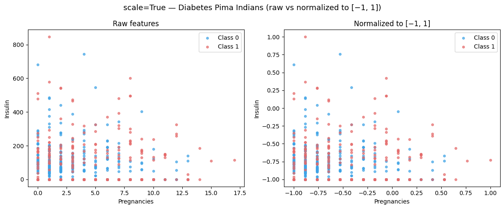

---

### `percent_of_data`

Subsamples the full dataset to the given percentage while preserving class proportions.

```python
dataset = get_dataset('Moons', percent_of_data=50)  # keep 50% of data
```

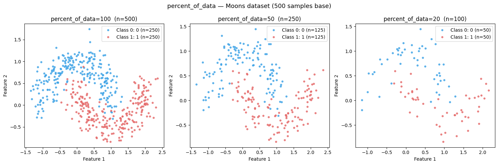

---

### `minority_reduce_scaler`

Reduces the minority class in the **train** split by the given factor,
creating a class-imbalanced training set (useful for cost-sensitive learning).

```python
dataset = get_dataset('Moons', minority_reduce_scaler=2)
train, test = dataset.get_train_test_split()
```

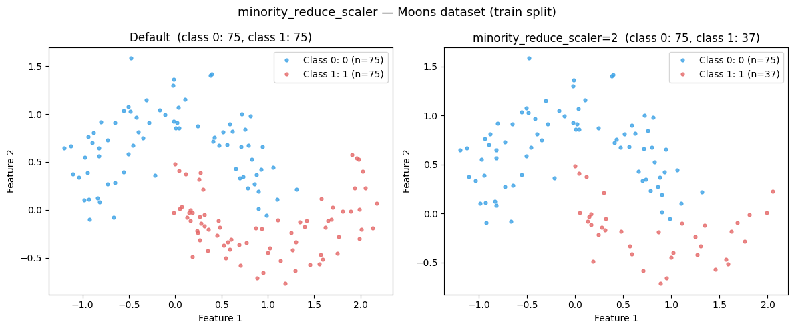

---

### `dim_reducer`

Applies dimensionality reduction to the split output.
Supported methods: `PCA`, `kernelPCA`, `TSNE`, `UMAP`, `UMAP_supervised`.
Shown on the Wine dataset (13 features projected to 2D).

```python
dataset = get_dataset('Wine', dim_reducer='UMAP', reduce_to_dim=2)
train, test = dataset.get_train_test_split()
```

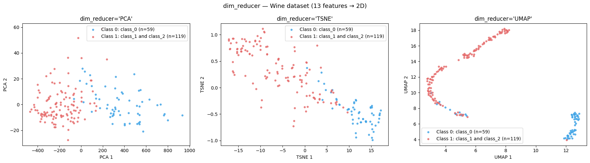

</details>

## Installation

Requires Python 3.11+. Uses uv for dependency management.

```bash
# Clone and install
git clone https://github.com/your-username/toy_datasets.git
cd toy_datasets
uv sync

# Or install with dev dependencies
uv sync --group dev
```

## Quick Start

```python
import data_loaders

# Load a dataset
loader = data_loaders.get_dataset('Iris')

# Get features and labels
X = loader.get_X()
y = loader.get_y()

# Get train/test split (preserves class proportions)
train, test = loader.get_train_test_split()

# With options
loader = data_loaders.get_dataset(
    'Moons',
    scale=True,           # Normalize to [-1, 1]
    train_size=0.8,       # 80% train, 20% test
    dim_reducer='PCA',    # Apply PCA
    reduce_to_dim=2       # Reduce to 2 dimensions
)
```

## Loader API

All loaders inherit from `AbstractLoader` and provide:

```python
loader.get_X()                  # Feature array (numpy)
loader.get_y()                  # Label array (numpy)
loader.get_train_test_split()   # Returns (train_dict, test_dict)
loader.get_description()        # Dataset description
loader.get_feature_names()      # List of feature names
loader.get_label_names()        # List of class names
loader.get_info()               # Full dataset info string
loader.plot_dataset()           # Visualize the dataset
loader.plot_train_test_split()  # Visualize train/test split
```

## Common Options

```python
loader = data_loaders.get_dataset(
    'Iris',
    shuffle=True,            # Shuffle data (default: True)
    set_seed=42,             # Random seed for reproducibility
    train_size=0.5,          # Train set proportion (default: 0.5)
                             # The rest is used for the test set
    minority_reduce_scaler=2,# Reduce minority class in train set to 1/2 
                             # (default: None, no reduction)
    minority_reduce_scaler_test=2,# Reduce minority class in test set to 1/2 
                             # (default: None, no reduction)    
    equal_test=False,        # Whether to make the test set 
                             # perfectly balanced (overrides 
                             # minority_reduce_scaler_test)                   
    scale=True,              # Apply MinMax scaling
    percent_of_data=50,      # Use only 50% of data
    equal_test=True,         # Balance test set classes
    dim_reducer='PCA',       # 'PCA', 'UMAP', 'TSNE', 'kernelPCA'
    reduce_to_dim=2,         # Target dimensions
)
```

## Testing

```bash
uv run pytest                     # Run all tests
uv run pytest -m "not slow"       # Skip slow tests (MNIST, t-SNE)
uv run pytest --cov=data_loaders  # With coverage report
```

## Sub-packages

Each sub-package has its own README with full details.

| Sub-package | Description |
|---|---|
| [`data_loaders/utils/`](data_loaders/utils/README.md) | Normalization, shuffling, seeding, train/test splitting |
| [`data_loaders/resampling/`](data_loaders/resampling/README.md) | Upsampling, SMOTE, and downsampling for class imbalance |
| [`data_loaders/embeddings/`](data_loaders/embeddings/README.md) | PCA, kernel PCA, t-SNE, UMAP dimensionality reduction |
| [`data_loaders/plotting/`](data_loaders/plotting/README.md) | Dataset visualisation and terminal rendering |
| [`data_loaders/loaders/synthetic_generators/`](data_loaders/loaders/synthetic_generators/README.md) | XOR, Moons, Blobs, Circles, Gaussian generators |
| [`data_loaders/loaders/web_loaders/`](data_loaders/loaders/web_loaders/README.md) | Iris, Wine, Breast Cancer, Heart Disease, MNIST, CIFAR-10, CIFAR-100, CIFAR-10N |
| [`data_loaders/loaders/local_loaders/`](data_loaders/loaders/local_loaders/readme.md) | CSV-backed loaders (diabetes, banknote, costcla, etc.) |
| [`data_loaders/loaders/external_loaders/`](data_loaders/loaders/external_loaders/README.md) | MIMIC-III/IV medical datasets (require special access) |

## Project Structure

```
toy_datasets/
├── data_loaders/
│   ├── main.py                   # Registry and get_dataset()
│   ├── utils/                    # Normalization, splitting utilities
│   ├── resampling/               # Upsampling and downsampling
│   ├── embeddings/               # PCA, UMAP, t-SNE wrappers
│   ├── plotting/                 # Visualisation and terminal rendering
│   └── loaders/
│       ├── abstract_loader.py    # Base class for all loaders
│       ├── synthetic_generators/ # XOR, Moons, Blobs, etc.
│       ├── web_loaders/          # Iris, Wine, MNIST, CIFAR-10/100/10N, etc.
│       ├── local_loaders/        # CSV-based datasets
│       └── external_loaders/     # MIMIC (requires access)
├── data_loaders/datasets/        # Bundled CSV files
├── tests/                        # pytest test suite
└── pyproject.toml                # Project configuration
```

## License

MIT
