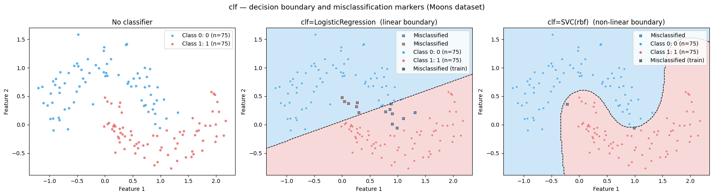
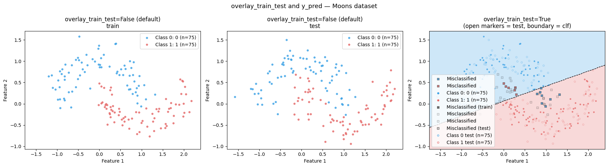

# data_loaders.plotting

Dataset visualisation and terminal rendering utilities.

## Overview

`plot_dataset` produces a 2D scatter plot of any dataset, applying
dimensionality reduction automatically when the data has more than two
features. The terminal rendering helpers let you display plots directly in
your terminal without a GUI.

## Visual Examples

**Single low-dimensional dataset** — raw 2D scatter, no reduction needed:


**High-dimensional dataset** — 13 features projected to 2D via PCA automatically:


**Train/test split view** — `plot_train_test_split` renders both sets side-by-side with
consistent axis scaling:


**Classifier decision boundary** — shaded regions and misclassification markers (×):



**Overlay mode** — train and test on one axes, test shown as open markers:



## Functions and Classes

### `plot_dataset(X, y, ...)`

Plot a dataset in 2D with optional classifier overlay.

```python
from data_loaders.plotting import plot_dataset

plot_dataset(
    X,                          # feature matrix (train / full dataset)
    y,                          # labels
    X_test=None,                # test feature matrix (optional)
    y_test=None,                # test labels (optional)
    dataset_name=None,          # figure suptitle
    label_names=None,           # list of class name strings
    terminal_plot=False,        # render in terminal instead of a window
    dim_reducer_method='TSNE',  # 'PCA', 'TSNE', or 'UMAP'
    ax=None,                    # existing Axes (or 2-tuple for side-by-side)
    clf=None,                   # classifier callable (original feature space)
    y_pred=None,                # pre-computed predictions for X
    y_pred_test=None,           # pre-computed predictions for X_test
    overlay_train_test=False,   # True → single axes with train + test overlaid
    test_alpha=0.3,             # opacity of test points in overlay mode
)
```

**Returns** `(fig, ax)` when `ax=None`; `None` when a custom `ax` is provided.
For the side-by-side layout the second element is `[ax_train, ax_test]`.

#### Classifier parameters

| Parameter | Type | Description |
|---|---|---|
| `clf` | `callable(X) -> labels` | Classifier in **original feature space**. Used to draw decision boundary regions (only when data is already 2D) and mark misclassified points with × on the scatter. |
| `y_pred` | `np.ndarray` | Pre-computed predictions for `X`. If given alongside `clf`, used for point marking; `clf` still draws the boundary. If given without `clf`, only misclassification × markers are shown (no boundary). |
| `y_pred_test` | `np.ndarray` | Pre-computed predictions for `X_test`. |

#### Overlay parameters

| Parameter | Type | Default | Description |
|---|---|---|---|
| `overlay_train_test` | `bool` | `False` | Plot train and test on one axes instead of two subplots. Train: filled circles. Test: open circles at `test_alpha`. |
| `test_alpha` | `float` | `0.3` | Opacity for test scatter points in overlay mode. |

---

### `terminal_show()`

Render all open matplotlib figures in the terminal using default settings,
then restore the original `plt.show()`.

---

### `enable_terminal_show(mode, width, height, clear, close, dpi, margin_cols)`

Monkey-patch `plt.show()` to render in the terminal. Returns a
`TerminalPlotter` instance; call `.disable()` to restore normal behaviour.
Can also be used as a context manager.

---

### `TerminalPlotter`

Class-based terminal renderer. Rendering modes:
- `'auto'` — iTerm2 inline PNG when available, otherwise text scatter.
- `'text'` — character-grid scatter plot with axis labels.
- `'ascii'` — ASCII-art rasterisation (requires `pillow`).
- `'iterm2'` — inline PNG via OSC 1337 protocol (iTerm2 only).

## Usage

```python
import data_loaders
from data_loaders.plotting import plot_dataset, enable_terminal_show
from sklearn.linear_model import LogisticRegression

loader = data_loaders.get_dataset('Moons')
train, test = loader.get_train_test_split()

# Basic side-by-side train/test plot
plot_dataset(train['X'], train['y'], X_test=test['X'], y_test=test['y'],
             dataset_name='Moons', dim_reducer_method='PCA')

# With classifier boundary and misclassification markers
clf = LogisticRegression().fit(train['X'], train['y'])
plot_dataset(train['X'], train['y'], clf=clf.predict,
             dataset_name='Moons', dim_reducer_method='PCA')

# Overlay train + test with transparent test points
plot_dataset(train['X'], train['y'], X_test=test['X'], y_test=test['y'],
             overlay_train_test=True, test_alpha=0.35, clf=clf.predict,
             dataset_name='Moons', dim_reducer_method='PCA')

# Pre-computed predictions only (no boundary drawn)
y_pred = clf.predict(train['X'])
y_pred_test = clf.predict(test['X'])
plot_dataset(train['X'], train['y'], X_test=test['X'], y_test=test['y'],
             y_pred=y_pred, y_pred_test=y_pred_test, dim_reducer_method='PCA')

# Embed in a larger figure
import matplotlib.pyplot as plt
fig, axes = plt.subplots(1, 2, figsize=(12, 5))
plot_dataset(train['X'], train['y'], X_test=test['X'], y_test=test['y'],
             ax=axes, dim_reducer_method='PCA')
plt.show()

# AbstractLoader convenience methods
loader.plot_dataset(clf=clf.predict)
loader.plot_train_test_split(overlay_train_test=True, clf=clf.predict, test_alpha=0.4)

# Render in terminal
with enable_terminal_show():
    plot_dataset(train['X'], train['y'], terminal_plot=True)
```
